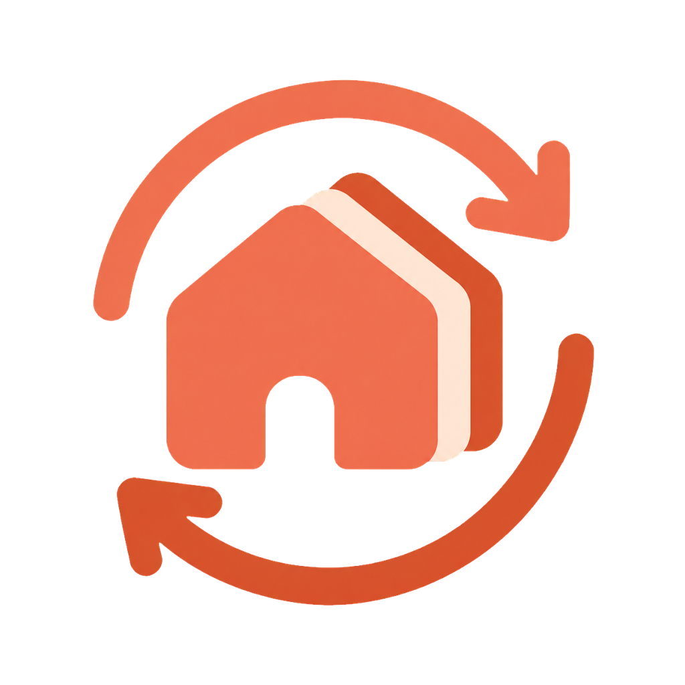

<div align="center">



# clihome

**List, inspect, create, and sync the config homes of AI coding CLIs** —
Claude Code, Codex, … (`~/.claude*`, `~/.codex*`), one home per account.

</div>

```bash
npm install -g clihome              # install via npm (prebuilt binary, no Go needed)
clihome                             # then run it
```

```bash
go build -o clihome ./cmd/clihome   # …or build the binary from source
go install ./cmd/clihome            # …or install it onto your $GOBIN
./clihome                           # then run it
```

```bash
clihome                    # interactive table of every home, across tools
clihome list               # all ~/.claude*, ~/.codex*, … homes
clihome info claude2       # account + config details for one home
clihome new [tool]         # create the next free ~/.<tool><n>
clihome sync --from claude2 --to claude --status --diff
clihome sync --from codex2 --to codex --all
```

---

## Why

Running more than one account — or more than one tool — means juggling parallel
config homes (`CLAUDE_CONFIG_DIR=~/.claude2 claude`, `CODEX_HOME=~/.codex2 codex`).
They drift: your instructions, settings, skills, rules and memory end up
different in each. `clihome` lists every home (grouped by tool), shows whose
account each one is, and mirrors your setup from one onto another of the **same
tool** — safely, with a diff preview and backups.

## Commands

| Command | What it does |
|---|---|
| `clihome` | Interactive homes table — pick a home to sync, view, or delete; or add a new one. |
| `clihome list` (`ls`) | Every `~/.<tool>*` home with tool, account, model, last-active. |
| `clihome info [name]` | Account + config details for a home (provider-specific). |
| `clihome new [tool]` | Scaffold the next unused `~/.<tool><n>`, ready for a fresh login. |
| `clihome aliases` | Print shell aliases so each home launches as `claude2`, `codex2`, … |
| `clihome install` | Write those aliases into `~/.zshrc` (idempotent, backed up). |
| `clihome sync` | Mirror one home onto another of the same tool. |

```text
  ◆ clihome  ·  AI CLI config home manager
  ────────────────────────────────────────────────────

     HOME      TOOL     ACCOUNT                 MODEL     LAST ACTIVE
   ○ claude    Claude   —                       —         7h ago
   ● claude2   Claude   you@example.com         opus      9m ago
   ● codex     Codex    you@work.com            gpt-5.5   8h ago
```

### Launching a home

A home is a config **directory**, not a command — the tool is launched with its
env var pointing at the home:

```bash
CLAUDE_CONFIG_DIR=~/.claude2 claude
CODEX_HOME=~/.codex2 codex
```

`clihome install` generates shortcuts for that:

```bash
clihome install            # writes claude2, codex2, … into ~/.zshrc
source ~/.zshrc            # now: claude2, codex2 launch their home
```

## Sync

Sync only happens **within one tool** (`claude → claude2`, `codex → codex2`).
The `--from` home is the **source of truth**; it is mirrored onto the destination.

```
-f, --from <home>     source (claude2 | codex2 | …)
-t, --to <home|all>   destination home, or 'all' same-tool homes
    --all             mirror the WHOLE home (except account/sessions/caches)
-n, --status          preview only — no writes
    --diff            with --status, print full file diffs
    --delete          also remove destination-only files (true mirror)
-y, --yes             apply without confirming
```

Run `clihome sync` with no flags on a terminal to pick source, destination, and
action with the keyboard — with a **“Review file changes”** diff pager and a
**“Select files to sync”** checkbox step.

### What syncs

By default a per-tool **allowlist** of portable config is synced (Claude:
`CLAUDE.md`, `settings.json`, `skills/`, plugin lists, `projects/*/memory/`;
Codex: `config.toml`, `rules/`, `skills/`, `memories/`, …).

**Everything mode** (`--all`) mirrors the *whole* home instead — but every tool
keeps a non-negotiable **denylist** that's excluded in any mode: the
account/login, live sessions, history, runtime state, caches, and DB files.
Copying those would hijack the destination's account or clobber its live data.

### Safety

- **Reversible** — before any overwrite, the destination copy is saved to
  `~/.clihome/backups/<timestamp>/<home>/`. Deleting a home moves it to
  `~/.clihome/trash/` (never `rm -rf`).
- **Additive by default** — destination-only files are kept unless you pass `--delete`.
- **Symlink-aware**, and the account/auth file is **never** synced.

## Adding a tool

`clihome` is provider-driven — adding another AI CLI is one file in
[`internal/provider/`](internal/provider/) with an `init()` that registers it:

```go
func init() {
    Register(&Provider{
        ID: "gemini", Label: "Gemini", Prefix: "gemini",   // ~/.gemini, ~/.gemini2
        Env: "GEMINI_CONFIG_DIR",                           // env var pointing the CLI at a home
        Command:  "gemini",
        Manifest:  []string{"settings.json", "commands"},   // portable config to sync
        DenyPaths: []string{"oauth_creds.json", "sessions", "logs", "cache"},
        DenyRegex: []string{`\.(log|lock)$`, `-cache\.json$`},
        // optional: ActiveFiles, EmailFn, ModelFn, PlanFn, InfoRowsFn, UsageFn, TokensFn
    })
}
```

That's it — discovery, the homes table, sync, everything-mode, `new`, `delete`,
and `info` are all generic and pick it up automatically.

## Compatibility

A single static **Go** binary (Go ≥ 1.24), no runtime dependencies,
cross-platform (macOS · Linux · Windows). The interactive cockpit is best in a
modern truecolor terminal; the flag-based CLI and `j`/`k` keys work everywhere.

## Development

```bash
go run ./cmd/clihome list   # run from source
go build -o clihome ./cmd/clihome   # build the binary
go test ./...               # run the tests
```

## License

MIT © clihome contributors
